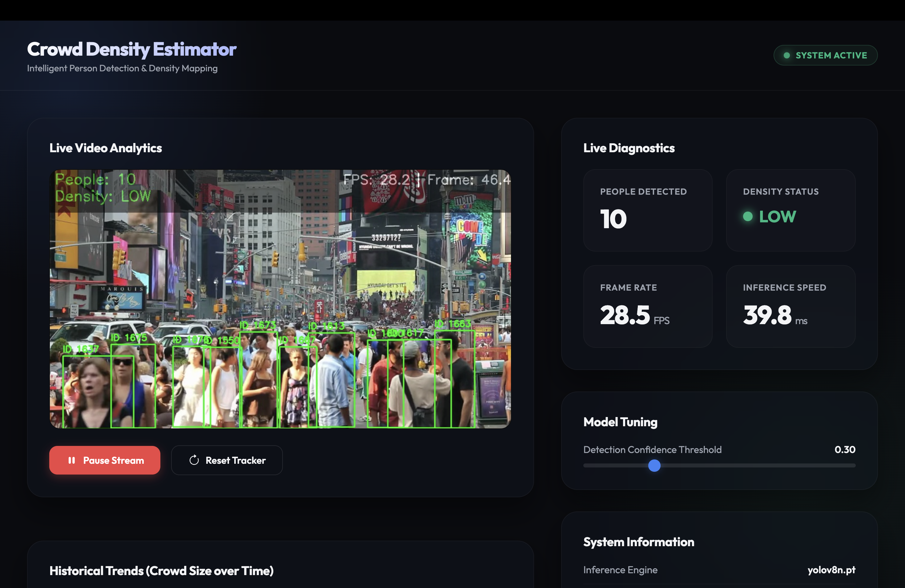

# 🚶 Crowd Density Estimation at 70 FPS

> Real-time crowd density estimation using **YOLOv8** for person detection and **ByteTrack** for multi-object tracking — running at up to **70 FPS**.



---

## 👤 Author

**Prince Maurya**
GitHub: [@princemaurya](https://github.com/princemaurya)

---

## 📌 What is this project?

This project is a **real-time crowd density estimation system** that:

- Detects people in video using **YOLOv8n** (nano model, optimized for speed)
- Tracks individuals across frames using **ByteTrack**
- Overlays **bounding boxes**, **tracking IDs**, **density level**, and **FPS** on each frame
- Classifies crowd density into four levels:

| Level | Description |
|-------|-------------|
| 🟢 LOW | Sparse crowd, free movement |
| 🟡 MODERATE | Noticeable crowd, some congestion |
| 🔴 HIGH | Dense crowd, limited movement |
| ⛔ CRITICAL | Very dense, safety risk |

---

## 🛠️ Tech Stack

| Component | Technology |
|-----------|------------|
| Detection | YOLOv8n (Ultralytics) |
| Tracking | ByteTrack |
| Framework | OpenCV, PyTorch |
| Config | YAML |
| Language | Python 3.8+ |

---

## 📁 Project Structure

```
Crowd-Density-Estimation/
├── main.py             # Main entry point
├── density.py          # Density calculation & classification logic
├── tracker.py          # ByteTrack wrapper
├── utils.py            # FPS counter & overlay drawing utilities
├── config.yaml         # Configuration (video path, model, display, etc.)
├── requirements.txt    # Python dependencies
├── yolov8n.pt          # Pre-trained YOLOv8 nano model
└── yolox/              # ByteTrack core tracker implementation
```

---

## ⚙️ Configuration (`config.yaml`)

```yaml
video_path: "nyc crowd.mp4"   # Input video path
resize_width: 960              # Processing width
resize_height: 540             # Processing height
display: true                  # Show live output window
save_output: false             # Save annotated video
output_path: "output.mp4"      # Output video path (if saving)
use_half: true                 # Use FP16 precision (CUDA only)
device: "cpu"                  # "cuda" or "cpu"
yolo_model: "yolov8n.pt"       # YOLOv8 model weights
```

---

## 🚀 Getting Started

### 1. Clone the repository

```bash
git clone https://github.com/princemaurya/Crowd-Density-Estimation.git
cd Crowd-Density-Estimation
```

### 2. Install dependencies

```bash
pip install -r requirements.txt
```

### 3. Run the estimator

```bash
python main.py
```

> Press **`Q`** to quit the live display window.

---

## 📊 Performance

- Runs at up to **70 FPS** on GPU with FP16
- Optimized using **YOLOv8 nano** for maximum speed
- Supports both **CPU** and **CUDA** inference

---

## 📄 License

This project is licensed under the **MIT License** — see the [LICENSE](LICENSE) file for details.

---

**Made with ❤️ by [Prince Maurya](https://github.com/princemaurya)**
